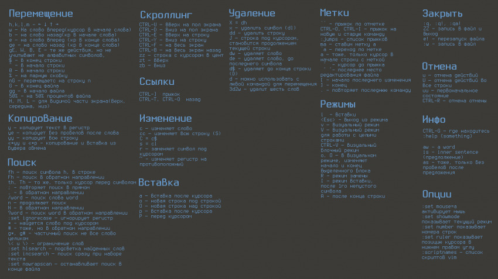

Установка Vim
----
	sudo apt-get install vim

Также можно запустить обучающую программу, набрав в терминале команду
----
	vimtutor
или
	gvimtutor
Это небольшая обучающая программа поможет за 25-30 минут освоиться в этом необычном для новичка редакторе.

Видео
<video  controls>
<source src="https://localhost:44372/Page/Media?book=TestBook&path=source/v.mp4" type="video/mp4">
</video>
<form>

<label id="range_label" for="formControlRange">Speed: 1</label>
<input id="range"  type="range" class="form-control-range" onchange="speedChanger(this)" value="1.0" data-value="1.0" min="0.25" max="4" step="0.25" id="formControlRange">

</form>

Name: 123
<audio controls> 
<source src="https://localhost:44372/Page/Media?book=TestBook&path=source/123.mp3" type="audio/mpeg" /> 
</audio>

<label>FileName.jpg</label>
<a href="https://localhost:44372/Page/Image?book=TestBook&path=source/vim.jpg" download="vim.jpg" >
<button class="btn pull-right" ><i class="fa fa-download"></i> Download</button>
</a>

